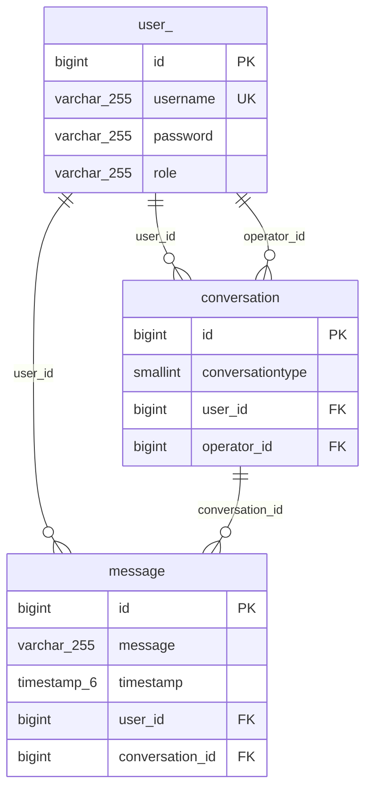

# Customer Service API

A REST API built with Quarkus for managing customer service conversations. This application allows users to send messages of different types, while operators can view and respond to these messages.

## 🏗️ Tech Stack

- **Framework**: Quarkus 3.24.5
- **Language**: Java 21
- **Database**: PostgreSQL (with Hibernate ORM Panache)
- **Security**: Quarkus Security JPA with password hashing
- **API Documentation**: OpenAPI/Swagger
- **Testing**: JUnit 5, AssertJ

## 📋 Requirements

- Java 21 or higher
- Docker (for running Postgres with Dev Services)

## 🚀 Getting Started

### Development Mode

Run the application in development mode with live coding enabled:

```shell
./mvnw quarkus:dev
```

The application will be available at http://localhost:8080

### Testing

Execute tests while in dev mode by pressing `r`, or run tests separately:

```shell
./mvnw test
```

## 📊 Database Schema


Also, available as [image](/imgs/db.png).

## 🔍 API Endpoints

Once the application is running, you can explore the API at:

- **API Documentation**: http://localhost:8080/q/swagger-ui

Main endpoints include:

- `/user` - User management
- `/conversations` - Message conversations

Requests examples are available in [docs/conversation.http](docs/conversation.http).

## 🛠️ Configuration

Configuration properties can be found in [application.yaml](src/main/resources/application.yaml).

Customize the application by setting environment variables or updating the configuration file.

## 💡 Development Tips

- Use Dev UI at http://localhost:8080/q/dev/ for development tools
- Hot reload is enabled in dev mode
